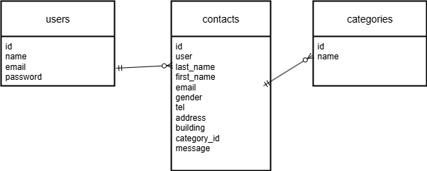

# お問い合わせフォーム

## 環境構築
Dockerビルド
1.git clone git@github.com:kakukai15/laravel-contact.git

2.docker-compose up -d --build

Laravel環境構築
1.docker-compose exec php bash
2.composer install
3.env.exampleファイルから.envを作成し、環境変数を変更
4.php artisan key:generate
5.php artisan migrate:fresh --seed
※ migrate でエラーが出る場合は、database/schema/mysql-schema.dump を削除してから再度実行してください。

## 使用技術
- PHP 7.3 以上
- Laravel 8.75 以上
- MySQL 8.0

## ER図

## URL
開発環境:http://localhost
phpMyAdmin: http://localhost:8080
